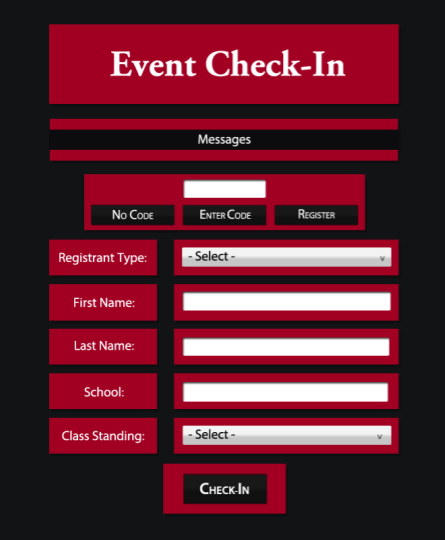

# Digital Art

Art of all mediums has always fascinated me. Digitally, I usually create through Adobe Suite (Photoshop, Illustrator, InDesign, etc.) or similar software. I do use traditional mediums as well, however incorporating my art into a digital piece provides just as much learning potential. I enjoy the crisp lines, vibrant colors, and versatility that digital art is able to accomplish.

---

  <!-- Indicators -->
  <ol class="carousel-indicators">
    <li data-target="#myCarousel" data-slide-to="0" class="active"></li>
    <li data-target="#myCarousel" data-slide-to="1"></li>
    <li data-target="#myCarousel" data-slide-to="2"></li>
  </ol>

  <!-- Wrapper for slides -->
  

    

      
    

    

      
    

  

  <!-- Left and right controls -->
  <a class="left carousel-control" href="#myCarousel" data-slide="prev">
    
    Previous
  </a>
  <a class="right carousel-control" href="#myCarousel" data-slide="next">
    
    Next
  </a>

---

## Circles

## Squares

## Posterization - Pen Tool
 

## Interface Design
 
 

## Icons

## Website Commissions

## Me

