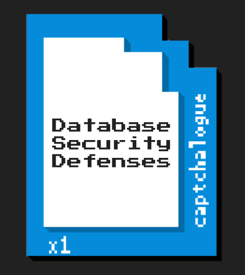

# Digital Art

Art of all mediums has always fascinated me. Digitally, I usually create through Adobe Suite (Photoshop, Illustrator, InDesign, etc.) or similar software. I do use traditional mediums as well, however incorporating my art into a digital piece provides just as much learning potential. I enjoy the crisp lines, vibrant colors, and versatility that digital art is able to accomplish.

## Billing Statement Design
My current line of work as a Graphic Designer involves creating mail pieces for clients. Sometimes, if they are unsure what they would like or only have a general idea, I will create an entirely new statement for them. The below pet license bill was created with just the prompt that they wanted an upgrade and a more modern looking statement.

## Newsletter Design
At my current company, some mail pieces we print and mail can include large newsletters. The below is a newsletter template I made from scratch for a client that wanted to portray a delicate, relaxing feel while remaining professional as a newsletter. I created the background vines as a vector using the pen tool, and was able to customize it to his specifications until the client was satisfied with the end result. The printed version is on an 11 x 17 sheet (duplex), folded in half as a booklet and included with their quarterly donation letters. This example contains only dummy text, as the articles and images change each quarter.

## Donnor Letter Design
Another type of mail piece I was asked to create can be seen here, which is a donation letter. The client asked that I use the 30th Anniversary logo as inspiration to make their letter background. I came up with several options, the top-left of which was chosen as the final version.

 
 

## CookBook Project
As a personal project, my mom and her colleagues wanted to make a cook book as a retirement gift. The book would be comprised of some favorite recipes by all of the employees that he had worked with over the years. Since I am a designer, my mom asked if I would compile the recipes into a cook book that we could print ourselves and present to him in a binder. I was glad to be a part of something so special, so of course I jumped at the chance. The following are a few pages for examples.

 
 

## Circles / Squares
These images were created for my design class through Adobe Photoshop, meant to give the illusion of transparency without actually applying any transparent layers. All objects in the images were physically placed, and the opacity for every shape is 100%.

## Posterization - Pen Tool
As a Harry Potter fan, I took an image of one of the movie promotions and posterized it using Adobe Photoshop. I then imported it into Adobe Illustrator and used the pen tool, as well as a set pallet of colors, to trace the posterization into a new style.

 

## Interface Design
For my senior project at EWU, I was tasked with re-designing the interface for a check-in kiosk that would accept user information at EWU career fairs to print off nametags and track attendee statistics. These are several mockups I made through Adobe Photoshop and presented to my team, all before I started programming the actual interface. I also needed to make sure that the kiosk followed the [EWU Identity Standards](https://access.ewu.edu/Documents/MarComm/EWU_IdentityStandards14.pdf), as this was going to be used at official EWU events.

[//]: # (## Website Commissions)
[//]: # (### Bible Logo)
[//]: # "This is a commission I did recently for a colleague, who was designing a website for a client's religious study group. It was created through Illustrator with the pen tool. It is a vector to be infinitely scalable, and the background is easily adjusted as the pallet of the website has not been determined yet."

[//]: # ( )

[//]: # (### Humane Society Graphics)
[//]: # "These images are to garnish a website that is for a humane society, which is still under development. I was also asked to make the link images containing other companies' logos uniform for phone and tablet compatibility."

[//]: # ()
[//]: # ( )
[//]: # ( )
[//]: # ()

[//]: # (## Icons)
[//]: # "I also polish up icons when needed, as shown below where I used a [Homestuck](http://www.mspaintadventures.com/) icon for inspiration on title slides for a powerpoint presentation."

[//]: # ()

