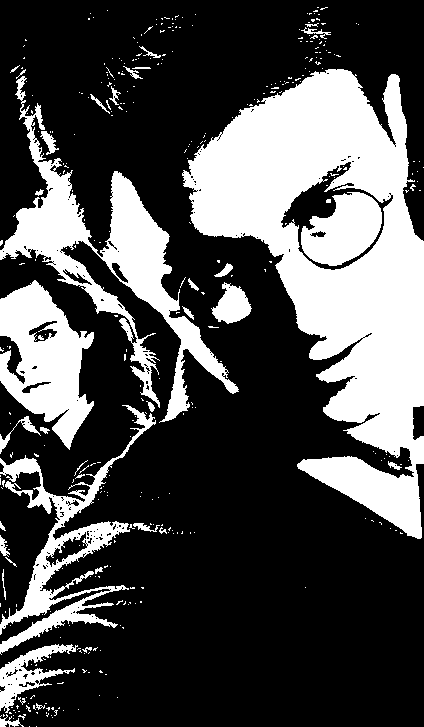

# Digital Art

Art of all mediums has always fascinated me. Digitally, I usually create through Adobe Suite (Photoshop, Illustrator, InDesign, etc.) or similar software. I do use traditional mediums as well, however incorporating my art into a digital piece provides just as much learning potential. I enjoy the crisp lines, vibrant colors, and versatility that digital art is able to accomplish.

## Deschutes TEST
This is Deschutes

## Circles / Squares
These images were created for my design class through Adobe Photoshop, meant to give the illusion of transparency without actually applying any transparent layers. All objects in the images were physically placed, and the opacity for every shape is 100%.

## Posterization - Pen Tool
As a Harry Potter fan, I took an image of one of the movie promotions and posterized it using Adobe Photoshop. I then imported it into Adobe Illustrator and used the pen tool, as well as a set pallet of colors, to trace the posterization into a new style.

 

## Interface Design
For my senior project at EWU, I was tasked with re-designing the interface for a check-in kiosk that would accept user information at EWU career fairs to print off nametags and track attendee statistics. These are several mockups I made through Adobe Photoshop and presented to my team, all before I started programming the actual interface. I also needed to make sure that the kiosk followed the [EWU Identity Standards](https://access.ewu.edu/Documents/MarComm/EWU_IdentityStandards14.pdf), as this was going to be used at official EWU events.

## Website Commissions
### Bible Logo
This is a commission I did recently for a colleague, who was designing a website for a client's religious study group. It was created through Illustrator with the pen tool. It is a vector to be infinitely scalable, and the background is easily adjusted as the pallet of the website has not been determined yet.

 

### Humane Society Graphics
These images are to garnish a website that is for a humane society, which is still under development. I was also asked to make the link images containing other companies' logos uniform for phone and tablet compatibility.

 
 

## Icons
I also polish up icons when needed, as shown below where I used a [Homestuck](http://www.mspaintadventures.com/) icon for inspiration on title slides for a powerpoint presentation.

