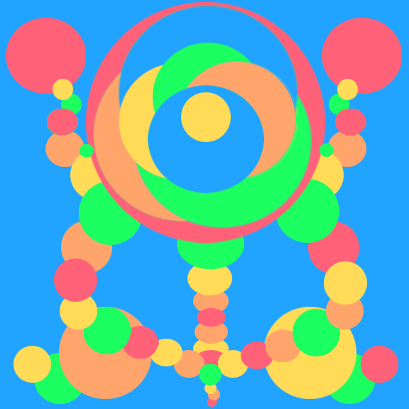

# Digital Art

Art of all mediums has always fascinated me. Digitally, I usually create through Adobe Suite (Photoshop, Illustrator, InDesign, etc.) or similar software. I do use traditional mediums as well, however incorporating my art into a digital piece provides just as much learning potential. I enjoy the crisp lines, vibrant colors, and versatility that digital art is able to accomplish.

## Circles



  
  
  ...



## Squares

## Posterization - Pen Tool
 

## Interface Design

## Icons

## Website Commissions

